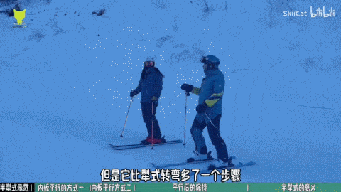
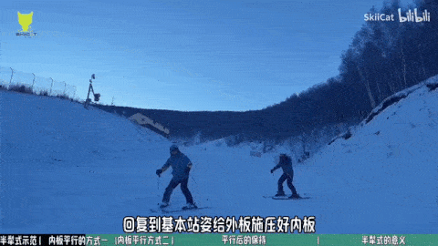
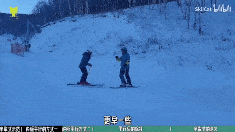
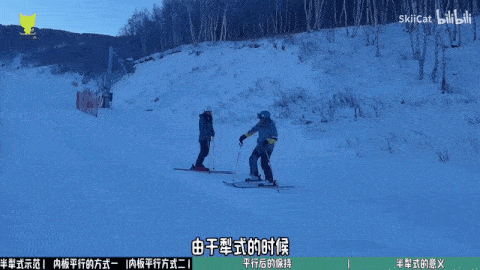
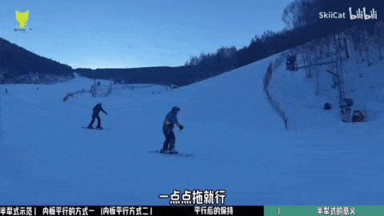
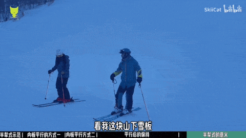
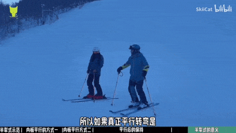
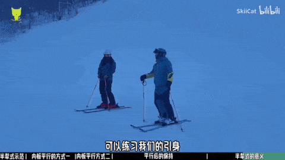
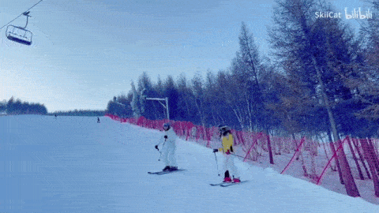

# 半犁式
入弯犁式，出弯平行式  

## 半犁式平行方法一
弯的后1/3段通过反弓给外板压力  
  
注意收内腿的时候不要改变身体的姿态

## 半犁式平行方法二（更早平行就会更难）
弯的前1/2段通过引身给外板压力，在沿着滚轮线之前就已经把雪板平行过来了  
  
相当于站在新外脚上，直接把旧外脚拖过来  
  

横向登坡练习（找不到平行方法二感觉时的练习）  

## 平行后的保持
- 是否已经很好地建立了外脚压力
- 内脚是否控制到位（虽然外脚承重，但是不能放任内脚不管）  

### 内腿没管理好导致v板  

## 半犁式的意义
半犁式是完全规避掉了板子完全在地上平行换刃的过程  
  

半犁式是可以快速突破的环节，可以一直停留在犁式，但是如果要进阶，不要一直停留在半犁式。  
半犁式可以滑任何地形，能回山减速，入弯又不用考虑换刃，所以很轻松。  

# 犁式转平行
犁式是平行的安全版  
平行进阶有困难，回来练犁式有帮助

## 基本流程
- 犁式滑好了，自然而然沿着横切，内腿就能自然跟过来与外腿平行
- 可以把弯滑大一点，顺着横向多感受横切慢慢平行的过程，过程中一定要一直**压住外脚**；
- 如果内腿无法自然平行，也不要强行内腿用力，这样反而会扣住膝盖，阻止平行；平行是自然发生的事，不是强迫的

## 滑完一个弯，怎么进入下一个弯
- 如果平行了，想进入下一个弯要把新山下腿打开，重新犁式
- 或者加一点侧滑给点速度（翻转脚踝，让板子平行；并将膝盖或脚尖从冲坡上转到冲坡下），重心还是维持在新山下脚

## 犁式转平行流程进阶理解
1. 滑好犁式转弯，掌握外腿驱转，做好反弓
2. 掌握半犁式的两种平行方式
3. 旧弯弯末通过引身给新外板更多压力
4. 通过滚动脚踝，换刃，交换重心

### 旧弯弯末变化压力注意点
### 外刃承重  
  

外刃承重练习  
  

### 引身
引身时要注意基本站姿，不要直接直起身子  
  

引身作用
- 交换两个雪板的压力
- 身体重心在入弯的时候通过引身往前带一点

注意引身后要慢慢入弯  

### 翻滚脚踝

## 常见问题
### 转弯时两只脚太紧张
从转弯，犁式到平行的过程中时，两只脚太紧张，脚会卡在刃中间，导致雪板动不了  
**解决方案**：跳一跳，放松下双腿
