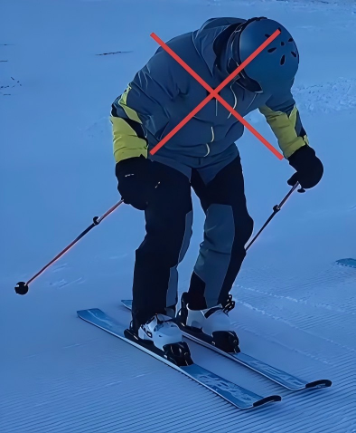
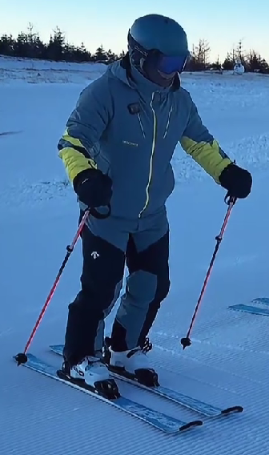
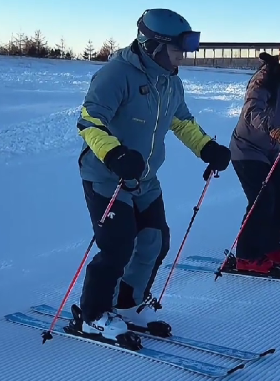
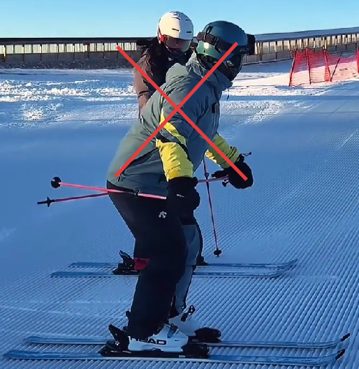
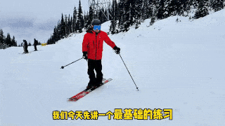
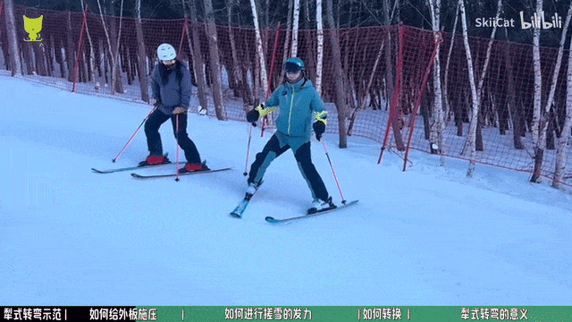
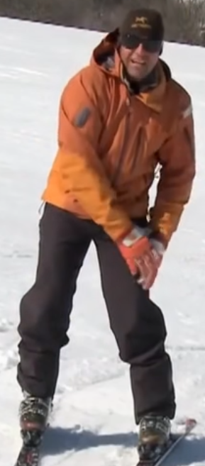
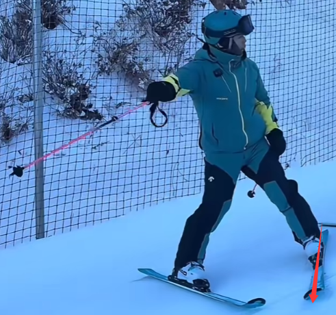

# 基本站姿
- 双腿微微前屈，轻压鞋舌
- 身体微微前倾，但不是往前倒
- **收紧核心（腹部）**
- 双手伸出来，不要往后放
- 整体重心落在雪板中间的位置

## 重心移动练习
### 前后移动
重心靠前错误姿势，容易腰疼撅屁股  

靠小腿前侧肌肉发力，以脚踝为轴身体整体靠前或靠后  

### 上下移动
对于业余爱好者来说，下到这种高度就差不多了，注意踝膝髋3个关节的联动  

不要撅屁股，要把骨盆收进来，否则腰会很累  

### 左右移动
重心左右移动错误示范  

重心左右移动正确示范  

## 保持好基本站姿是接下来滑行的基础

滑行时依旧注重基本站姿  

引身时错误站姿  

## 站姿平衡练习
- 保持基本站姿在原地跳起，注意是整个板一起跳一起落，板头或板尾先起说明重心没在中间
- 滑行时在弯末跳起，保持平衡，注意也是整个板一起跳一起落
- 人只有收的低才能跳起来，如果跳不起来，说明重心舒适区没有很多（可以用拖杖练习拓展舒适区）  

# 犁式刹车
- 旋转腿，旋转脚尖，脚尖往里压，往里进的感觉
- **不是踢脚后跟**，否则要推很大距离
- 手要伸出来，不要往后放
- 慢慢刹住，不要急刹

# 犁式转弯
## 基本流程
- 转换重心到新山下腿（摸膝盖）
- 折髋，身体向新山下脚这边靠
- 转腿（先转非承重腿）

## 进阶理解
- 真正向新山下腿施压的动作不是上身移动，而是骨盆往远离外腿的方向移，然后把上身稍微折回来（这能让外板立刃），注意骨盆不要移回来

- 再向外侧板垂直施加压力（微微屈膝压下去），把板弄弯，依靠离心作用转弯

注意上身不要有多余动作  

- 胯的带转，结合转腿，发力更加轻松（这样上身和板的分离角度也不会很大，称为雪板，骨盆和肩膀的对齐姿态）
  
这样也能有效解决上半身带转的问题   

转胯练习  

### 姿势转换
实际上犁式转弯重心一直在两板之间，不存在重心的转换。

但是存在姿势的转换，在骨盆横移，微微屈膝给压力后就不是基本站姿了；转弯结束需要回到基本站姿

## 如何控速
- 弯走得够不够横（最关键），弯越“圆”，速度越可控
  - 不要弯只拐了一点点，就急着进下一个弯
- 稳住重心在山下腿

## 重心转移到山下脚练习
- 扔掉雪仗，转弯时将双手放在膝盖上和大腿间的区域（如图所示），同时**注意上半身往山下脚靠**

- 弯结束后轻轻地站起，双手放正，然后让雪板转向另一半，再重复上述动作
- 培养将重心完全放在山下脚的感觉
- 训练熟练后可以拿着雪仗做，注意身体姿势要保持和没拿雪仗时一样

## 犁式转弯的意义
由于内腿的立刃会把人往山下推（内腿稍微承重就容易往山下走），所以相较于平行式，犁式往山上回更难；（高手在陡坡上滑犁式也不一定标准）  

这样就要求更加精准的给外腿更多压力，否则但凡有一点内倒就不容易回山。  
因此犁式转弯对于平行式时如何给外板压力有很好的练习作用。

### 犁式转弯拖杖练习（如何更好地给外板压力）
  

#### 一些进阶练习
标枪弯  
  

鹤弯  

## 常见错误
### 重心后座
弯前没有控制好速度，导致人自然恐惧速度，转弯时重心落在雪板后半段  
**解决方案**：入弯前先把新山下脚犁式打开，慢慢搓雪降速转弯。（进弯稳）

### 身体往山上靠
- 重心还停留在山上脚  
**解决方案**：重心转换

- 没控好速，身体本能往山上靠来转弯，这样会有很多急转弯，急刹，横切，弯会是Z字形的  
**解决方案**：控速

### 上身带转
和速度太快有点关联，速度太快受不了，往想拐的地方倒就能转弯，导致带转  
直接结果：内侧脚很难抬起来（即使能抬起来也是靠着离心力），并且弯末身体是往山上靠的  
**解决方案**：控速

### 横向的弯末没速度，直接沿滚落线往下冲
导致速度太快控制不住，就容易出现身体往山上靠和Z字弯  
**解决方案**：入弯前先转新山下脚，犁式打开，慢慢搓雪降速转弯，这样弯就是一个圆润的弧形。

### 转弯时压脚压太死
导致转不动腿，只能按照板子朝向自动拐弯，然后往下走加速太多，不好控速  
**解决方案**：腿放松，不要压太死

### 内腿是直的
导致转弯时内腿不灵活，然后无法自然平行  
**解决方案**：两只腿保持轻压鞋舌

### 转弯时重心腿是直的
导致转完之后，身体会朝坡上，山下腿是蹬着的，旋转不动了  
**解决方案**：两只腿保持轻压鞋舌

### 板头碰到一起
重心靠后导致板头变轻，更容易晃，容易碰到一起；或者膝盖内扣了  
**解决方案**：控速并且小腿贴住鞋舌；膝盖不要内扣

### 入弯时膝盖内扣，身体后落
导致滑久了大腿变酸，膝盖痛

### 转弯力量断续
弯中发力停了会导致加速，弯就会变得好大  
**解决方案**：转弯时转腿力量要持续，直至慢下来
