# 平行
## 视线
- 保证视线朝着坡下，不要过分关注转弯时的横向视野，这有利于对障碍物做出反应
- 坡越是抖，越要朝坡下看的更远

## 转弯
### 转换阶段（更难，点杖引身滚动等待）
很容易出现犁式，需要提升外刃平衡能力和脚踝滚动能力。

#### 外刃平衡能力
到了半犁式的阶段就可以开始锻炼外刃能力了

##### 为什么需要外刃能力

外刃能帮助解决的问题：  
  

##### 上身稳定

##### 外刃能力测试
平行式直滑降，在缓坡，速度稍快就出现小犁式，扣膝，宽板距，说明外刃能力不足。暂时不要考虑完全的平行式，先把犁式转弯滑好。  

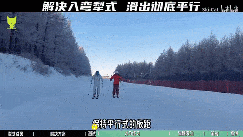

需要保持完全平行，雪板放平，脚的间距和膝盖间距一致，宁可有一点O腿，也不要有X，这些做好了说明有一定外刃能力。

##### 原地外刃支撑练习
保持基本站姿，用外刃支撑平衡  

- 足底大脚趾后侧，小脚趾后侧以及足跟3个点连成一个三角形，3个角要完全踩实在鞋垫上
- 脚趾不要翘起来，是轻轻往鞋垫上扒住的状态，增加受力面积
- 足踝关节要稳住，不能乱晃
- 核心稳住，上身不要晃荡
- 支撑腿要伸展到足够，不要屈腿，否则会很累
- 在保持以上姿态的情况下寻找身体往山上移动的平衡临界点
- 可以在一开始时用山上雪仗撑一下找临界点，平衡后撤掉雪仗
- 也可以在家里踩在海绵软垫和波速球上练

##### 外刃斜滑练习

注意滑出来的线应该是回山的线，而不是斜线，如果是斜线，说明立刃角度不够。

外刃练习需要胆量，多移重心，加大立刃角度，保持平衡。

注意这个动作一开始要有一定速度  
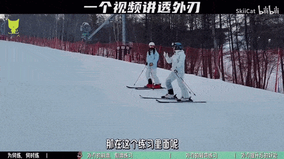

如果动作太难，可以交替起落  
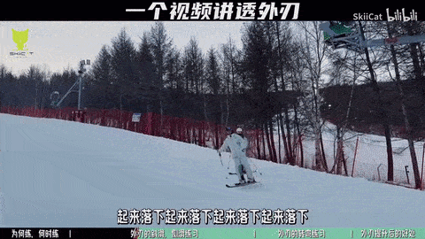

##### 横滑降
- 注意滑降过程中始终保持山上脚的压力更大（可以把核心微微往山上挪一点），如果山下板压力大说明立刃更高，会阻碍滑行
- 还要注意**山下脚先**滚动脚踝

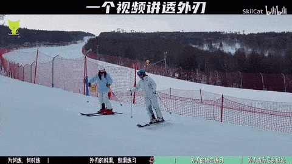

横滑降时可以根据滚落线方向调整板头方向：  

##### 外刃转弯练习
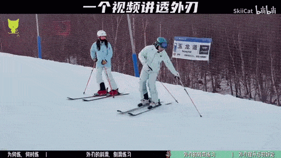
用手抵住拿雪仗，雪仗放在雪板中间往外五六十厘米，再往后20厘米处，雪仗撑实。

关键在于身体重心要敢于往山下移  

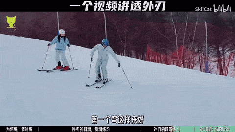

#### 犁式入弯问题
##### 犁式入弯问题的成因
- 外刃承重能力不足导致犁式入弯
- 重心过早地往新弯弯内移动（内倒，顶胯，带转）导致内侧雪板压力瞬间变大，我们反而希望新弯时外侧雪板压力变大

  
  

不慢慢入弯为何会有犁式？  

##### 犁式入弯解决方法
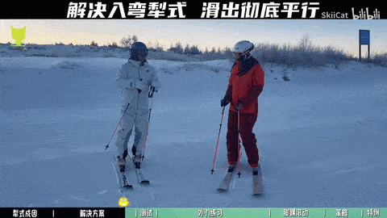  

#### 脚踝滚动能力
引身之后慢慢滚动脚踝，慢慢入弯。    
国外的教程将此处的脚踝滚动说成改变膝盖朝向，即扣内腿膝盖（这时外侧膝盖也会跟着动），把膝盖往内腿偏，达到换刃的效果，其目的和滚动脚踝是一样的。  
  
  
  
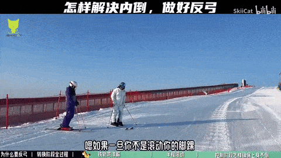

##### 脚踝滚动练习：铁轨弯
- 注意练习的时候脚趾不要翘起，反而应该扒住鞋垫以增加受力面积
- 内侧那只脚先滚动，比如往右滚，右脚先滚动
- 只适合在缓坡做，会越滑越快，陡坡做不了

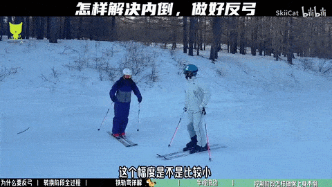
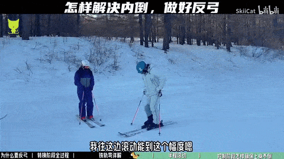

##### 横滑降练习
不要动骨盆，动的是脚踝  
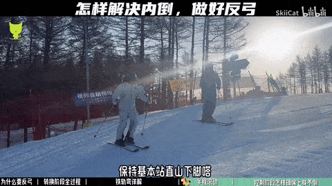  

轴转横滑降  
  

##### 转换阶段到控制阶段内倒

最常见3种错误入弯方式  

注意点：
1. 引身后不要直起上身，并且引身要朝雪板方向，而不是朝弯内方向扑  
  
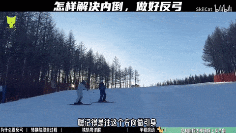
2. 不要为了山上板的承重向山上倒
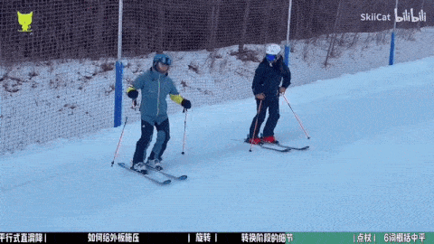
3. 滚动脚踝要先滚山下脚（也就是常说的内腿引导转弯外腿支撑平衡），然后差0.1s再滚山上脚
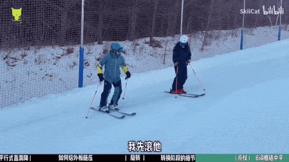
4. 不要用全幅鹤弯来躲避新内板的外刃平衡能力

5. 滚动脚踝之后等待，即使在陡坡也要如此

### 控制阶段（反弓旋转）
- 为了防止雪板侧滑，需要立刃
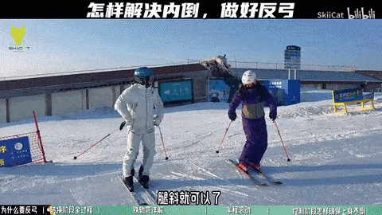  

- 立刃后，要让外侧雪板更多承重，然后外腿给外板施压

- 用胯或髋来旋转

#### 如何让外侧雪板更多承重
##### 反弓

- 首先往弯内横向移胯的目的是为了立刃；然后为了给外侧雪板压力，又必须把上半身折回来；
- 横向移胯的幅度要和当下的滑行速度匹配，速度越快，移得越多
- 对于初学者来说，只要横移幅度大了，就会出现内板承重更多，所以想大幅度横移就很难，这里给几个tips：
- 开始练习反弓时，可以宽板距，板距一宽，横移幅度就能更大  
  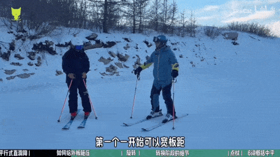  
- 自己用手推胯或者把一边胯往下压一边往上抬，体会骨盆倾斜的感觉（注意是动骨盆，不是扣住膝盖）  
  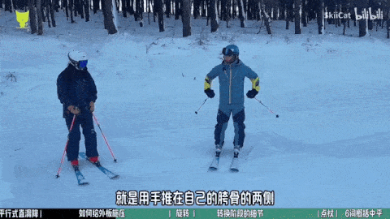  
    
- 反弓后不要忘了外腿给外板施压，施压时上身要保持稳定  
  

#### 如何给外板施压
反弓后不要忘了微屈外腿给外板施压，施压时上身要保持稳定。

#### J型弯（控制阶段练习）
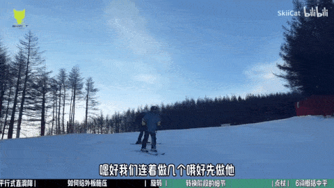

## 引身
引身指身体向坡度**垂直地**增加高度，而不是竖直地增加高度
- 往山下横向转新弯时：先把膝盖变成垂直于坡的方向，然后转腿，此时旧山下脚变短，新山上脚变长
  - 竖直的话，雪板无法变平，不容易转；
- 引身后，转弯开始时板子才是平的，才容易旋转脚；转弯过程中重心逐渐从旧山下脚转移到新下山脚；
- 然后随着转弯时膝盖的内移，板子才能立刃；
- 整个过程就是不断平板，不断立刃的过程；

## 反弓
- 一种在转弯时由于外腿承压和髋关节折叠自然出现的姿势
- 不是通过上半身向弯外折叠，而是通过保持上半身稳定，下半身倾斜产生的自然夹角
- 够用即可，自然的反弓有助于保持立刃角度和外板平衡
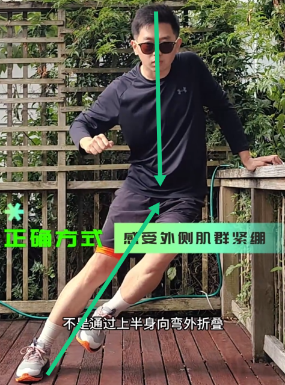

### 自然反弓练习
- 用髋和外腿顶住落地的力，不要内倒；
- 在蹬出时，新外腿主动伸长，旧外腿缩短
- 落地瞬间，模拟滚落线，压力最大，腿部肌肉顺势收缩弯曲来吸收部分能量  

### 常见错误
#### 腰部代偿
感觉到外侧腰被挤压，内侧腰被拉伸；腰反弓时，从正面看身体从头到脚会更像一个圆弧，而不是正确反弓时存在一个清晰的夹角  
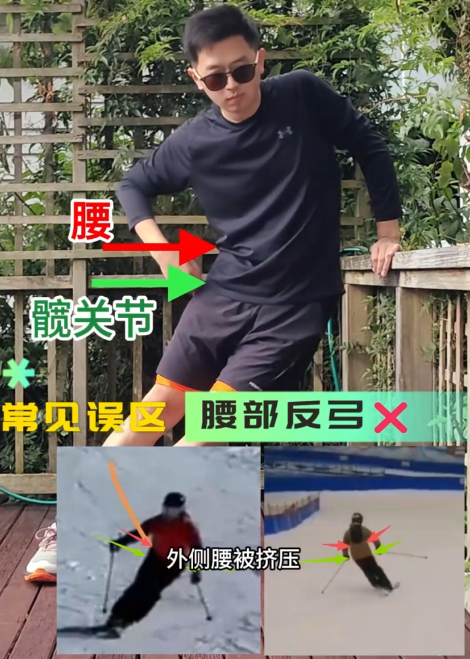  
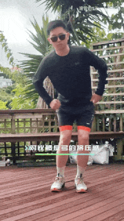  
**解决方案**：加大髋关节，膝关节和踝关节的弯曲程度，会限制腰的侧屈程度

#### 反拧式反弓
外髋滞后，上半身朝着弯外，导致立刃角度受限，外侧支撑弱   
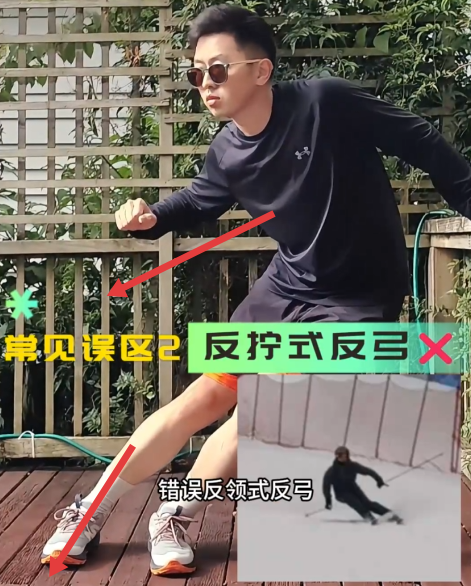  
**解决方案**：旋转外侧身体，对齐力线

## 平行刹车（冰球刹）
陡坡上滑行快速刹车的必备技巧。
- 练习这个动作需要比较大的初速度，开始可以斜着滚落线练习（直接沿滚落线速度太快）
- 保持上半身稳定，微微站起（减轻板压力更易旋转），然后重新向下施压，迅速旋转下半身，立刃并刹车（如图所示）  

- 注意上半身始终面朝前进方向，手一直放在前面
- 这个动作结束后可以微微站起（引身），衔接平行转弯（如图所示）  
  

## 如何控速
平行控速的核心 = 弧线 + 立刃时间
- 平行入弯时板头朝坡下一定会加速，这时是不好控速的，所以**一定是在上一个弯的结束时控速**
- 弯结束时控速，可以延长滑行距离或往山上走，弯走完整圆润的“圆”，想象在画一个S，而不是Z（如图所示）  
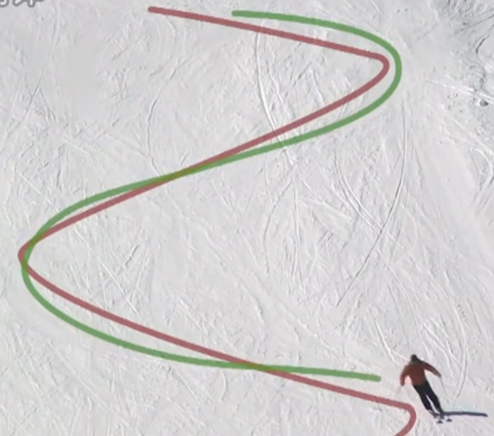

- 立刃的“持续时间”比角度重要，立刃时间一长，雪板自然减速。
- 出弯别急着放板，否则速度立刻起来

# 点杖
能做简单的平行之后就可以练习点杖了。如果加进去会乱，可以先不加，先做好5个动作（引身滚动等待，反弓旋转）

基础平行式的点杖相对比较虚，不怎么实际发力。

## 基本要点
- 上臂打开并稳定带有力量，点杖时上臂稳定不懂，动手腕，小臂可以动一点
- 入弯引身的同时点杖，点的位置在板子前1/4往要转的方向
- 弯越大，点杖离板越远，力量不用太大；弯越小，点杖近，力量用的越多
- 点杖时点完后，**一定不要**有往后撑一下的动作

- 点杖之后，重心从杖靠近的脚转换到远离的脚，靠近的脚变轻，如图所示
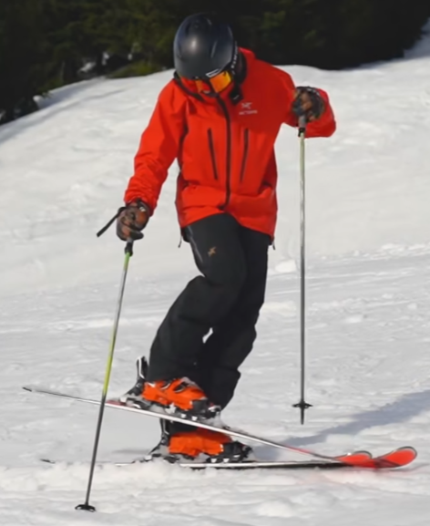

## 检测点杖时重心是否转移正确（平衡练习）
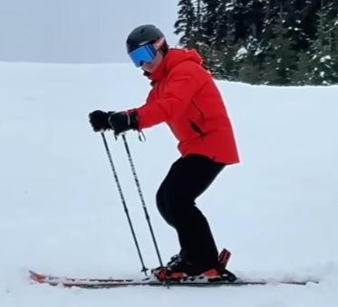  

- 上臂和大腿平行，在上臂不动，手不下垂的情况下，把身体降下来，拖着两根雪仗走，保持雪仗在雪面上
- 如果重心转移不正确，在山上脚的话，山下脚的杖是够不到的

## 常见错误
### 点杖之前身体没有靠山下脚
这样练不出点杖  
**解决方案**：身体要靠向山下脚，有点反弓的意味

### 点杖时杖被打走了
这种感觉是错的，说明手臂没稳定住或者点的位置错了。  
点杖的感觉和用雪仗往前后推的感觉不一样，借用的是旋转扭矩的力  
**解决方案**：稳定手臂

如果还是练起来感觉不对，那就是犁式转平行脚的基本功有问题（比如转弯之后，双板外八，不能平行，山下脚朝着横向，山上脚斜着向坡上了等）

