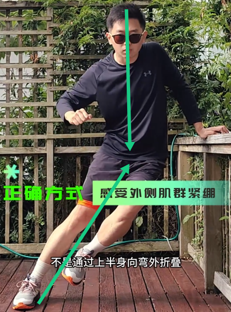
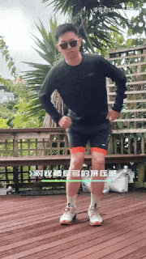
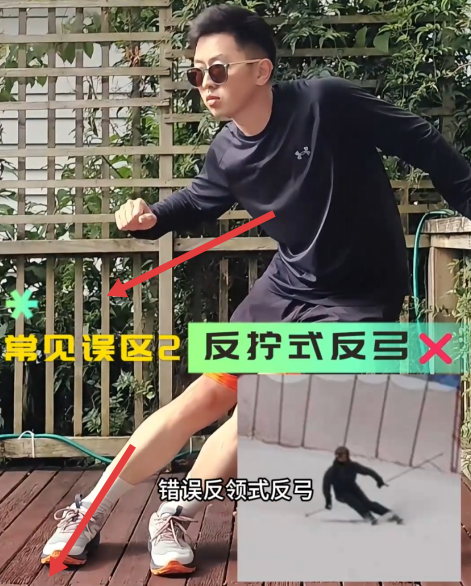
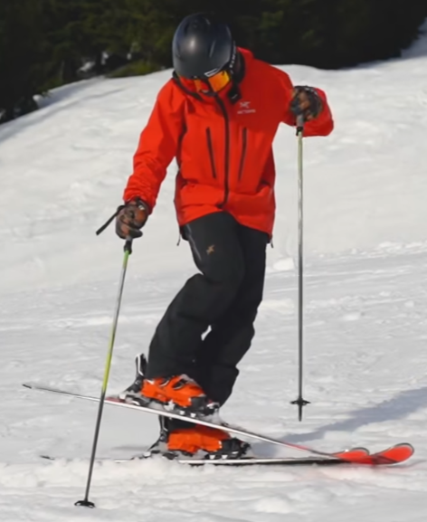

# 基本站姿
- 双腿微微前屈，轻压鞋舌
- 身体微微前倾
- 双手伸出来，不要往后放
- 整体重心落在雪板中间偏前的位置

# 犁式刹车
- 旋转腿，旋转脚尖，脚尖往里压，往里进的感觉
- **不是踢脚后跟**，否则要推很大距离
- 手要伸出来，不要往后放
- 慢慢刹住，不要急刹

# 犁式转弯
## 基本流程
- 转换重心到新山下腿（摸膝盖）
- 折髋，身体向新山下脚这边靠
- 转腿（先转非承重腿）

## 如何控速
- 弯走得够不够横（最关键），弯越“圆”，速度越可控
  - 不要弯只拐了一点点，就急着进下一个弯
- 稳住重心在山下腿

## 重心转移到山下脚练习
- 扔掉雪仗，转弯时将双手放在膝盖上和大腿间的区域（如图所示），同时**注意上半身往山下脚靠**  

- 弯结束后轻轻地站起，双手放正，然后让雪板转向另一半，再重复上述动作
- 培养将重心完全放在山下脚的感觉
- 训练熟练后可以拿着雪仗做，注意身体姿势要保持和没拿雪仗时一样

## 常见错误
### 重心后座
弯前没有控制好速度，导致人自然恐惧速度，转弯时重心落在雪板后半段  
**解决方案**：入弯前先把新山下脚犁式打开，慢慢搓雪降速转弯。（进弯稳）

### 身体往山上靠
- 重心还停留在山上脚  
**解决方案**：重心转换

- 没控好速，身体本能往山上靠来转弯，这样会有很多急转弯，急刹，横切，弯会是Z字形的  
**解决方案**：控速

### 上身带转
和速度太快有点关联，速度太快受不了，往想拐的地方倒就能转弯，导致带转  
直接结果：内侧脚很难抬起来（即使能抬起来也是靠着离心力），并且弯末身体是往山上靠的  
**解决方案**：控速

### 横向的弯末没速度，直接沿滚落线往下冲
导致速度太快控制不住，就容易出现身体往山上靠和Z字弯  
**解决方案**：入弯前先转新山下脚，犁式打开，慢慢搓雪降速转弯，这样弯就是一个圆润的弧形。

### 转弯时压脚压太死
导致转不动腿，只能按照板子朝向自动拐弯，然后往下走加速太多，不好控速  
**解决方案**：腿放松，不要压太死

### 内腿是直的
导致转弯时内腿不灵活，然后无法自然平行  
**解决方案**：两只腿保持轻压鞋舌

### 转弯时重心腿是直的
导致转完之后，身体会朝坡上，山下腿是蹬着的，旋转不动了  
**解决方案**：两只腿保持轻压鞋舌

### 入弯时膝盖内扣，身体后落
导致滑久了大腿变酸，膝盖痛

### 转弯力量断续
弯中发力停了会导致加速，弯就会变得好大  
**解决方案**：转弯时转腿力量要持续，直至慢下来

# 犁式转平行
犁式是平行的安全版  
平行进阶有困难，回来练犁式有帮助

## 基本流程
- 犁式滑好了，自然而然沿着横切，内腿就能自然跟过来与外腿平行
- 可以把弯滑大一点，顺着横向多感受横切慢慢平行的过程，过程中一定要一直**压住外脚**；
- 如果内腿无法自然平行，也不要强行内腿用力，这样反而会扣住膝盖，阻止平行；平行是自然发生的事，不是强迫的

## 滑完一个弯，怎么进入下一个弯
- 如果平行了，想进入下一个弯要把新山下腿打开，重新犁式
- 或者加一点侧滑给点速度（翻转脚踝，让板子平行；并将膝盖或脚尖从冲坡上转到冲坡下），重心还是维持在新山下脚

## 常见问题
### 转弯时两只脚太紧张
从转弯，犁式到平行的过程中时，两只脚太紧张，脚会卡在刃中间，导致雪板动不了  
**解决方案**：跳一跳，放松下双腿

# 平行
## 视线
- 保证视线朝着坡下，不要过分关注转弯时的横向视野，这有利于对障碍物做出反应
- 坡越是抖，越要朝坡下看的更远

## 转弯的注意点
上一个弯结束，身体状态是重心落在山下脚，板有刃角，膝盖偏坡上，上半身偏坡下

### 引身
引身指身体向坡度**垂直地**增加高度，而不是竖直地增加高度
- 往山下横向转新弯时：先把膝盖变成垂直于坡的方向，然后转腿，此时山下脚变短，山上脚变长
  - 竖直的话，雪板无法变平，不容易转；
- 引身后，转弯开始时板子才是平的，才容易旋转脚；转弯过程中重心逐渐从旧山下脚转移到新下山脚；
- 然后随着转弯时膝盖的内移，板子才能立刃；
- 整个过程就是不断平板，不断立刃的过程；

### 转腿
用非承重腿（内腿）来引导转弯，用承重腿（外腿）来支撑平衡，这样转弯更容易（这一点目前体会还不太深刻，有待开发）

## 立刃
- 转弯的过程通过压内腿膝盖，把膝盖往非重心脚偏（这时外侧膝盖应该也会跟着动），这样就能立刃 
- 新手只要一点点刃就够了

### 侧滑立刃练习
横向站在坡上，身体朝坡下，重心还是在山下脚，翻转脚踝，让雪板平板，出现侧滑；然后再反向翻转脚踝立刃，刹车；训练翻转脚踝的感觉。

### 轴转横滑降
侧滑+旋转

### 急停冰球刹
持续旋转雪板+快速增高立刃

## 反弓
- 一种在转弯时由于外腿承压和髋关节折叠自然出现的姿势
- 不是通过上半身向弯外折叠，而是通过保持上半身稳定，下半身倾斜产生的自然夹角
- 够用即可，自然的反弓有助于保持立刃角度和外板平衡  

### 自然反弓练习
- 用髋和外腿顶住落地的力，不要内倒；
- 在蹬出时，新外腿主动伸长，旧外腿缩短
- 落地瞬间，模拟滚落线，压力最大，腿部肌肉顺势收缩弯曲来吸收部分能量  

### 常见错误
#### 腰部代偿
感觉到外侧腰被挤压，内侧腰被拉伸；腰反弓时，从正面看身体从头到脚会更像一个圆弧，而不是正确反弓时存在一个清晰的夹角  
  
  
**解决方案**：加大髋关节，膝关节和踝关节的弯曲程度，会限制腰的侧屈程度

#### 反拧式反弓
外髋滞后，上半身朝着弯外，导致立刃角度受限，外侧支撑弱   
  
**解决方案**：旋转外侧身体，对齐力线

## 平行刹车（冰球刹）
陡坡上滑行快速刹车的必备技巧。
- 练习这个动作需要比较大的初速度，开始可以斜着滚落线练习（直接沿滚落线速度太快）
- 保持上半身稳定，微微站起（减轻板压力更易旋转），然后重新向下施压，迅速旋转下半身，立刃并刹车（如图所示）  

- 注意上半身始终面朝前进方向，手一直放在前面
- 这个动作结束后可以微微站起（引身），衔接平行转弯（如图所示）  
  

## 如何控速
平行控速的核心 = 弧线 + 立刃时间
- 平行入弯时板头朝坡下一定会加速，这时是不好控速的，所以**一定是在上一个弯的结束时控速**
- 弯结束时控速，可以延长滑行距离或往山上走，弯走完整圆润的“圆”，想象在画一个S，而不是Z（如图所示）  

- 立刃的“持续时间”比角度重要，立刃时间一长，雪板自然减速。
- 出弯别急着放板，否则速度立刻起来

# 点杖
能做简单的平行之后就可以练习点杖了。

## 基本要点
- 上臂打开并稳定带有力量，点杖时上臂稳定不懂，动手腕，小臂可以动一点
- 入弯的同时点杖，点的位置在板子前1/4往要转的方向
- 弯越大，点杖离板越远，力量不用太大；弯越小，点杖近，力量用的越多
- 点杖之后，重心从杖靠近的脚转换到远离的脚，靠近的脚变轻，如图所示

## 检测点杖时重心是否转移正确（平衡练习）
- 上臂和大腿平行，在上臂不动，手不下垂的情况下，把身体降下来，拖着两根雪仗走，保持雪仗在雪面上
- 如果重心转移不正确，在山上脚的话，山下脚的杖是够不到的

## 常见错误
### 点杖之前身体没有靠山下脚
这样练不出点杖  
**解决方案**：身体要靠向山下脚，有点反弓的意味

### 点杖时杖被打走了
这种感觉是错的，说明手臂没稳定住或者点的位置错了。  
点杖的感觉和用雪仗往前后推的感觉不一样，借用的是旋转扭矩的力  
**解决方案**：稳定手臂

如果还是练起来感觉不对，那就是犁式转平行脚的基本功有问题（比如转弯之后，双板外八，不能平行，山下脚朝着横向，山上脚斜着向坡上了等）

