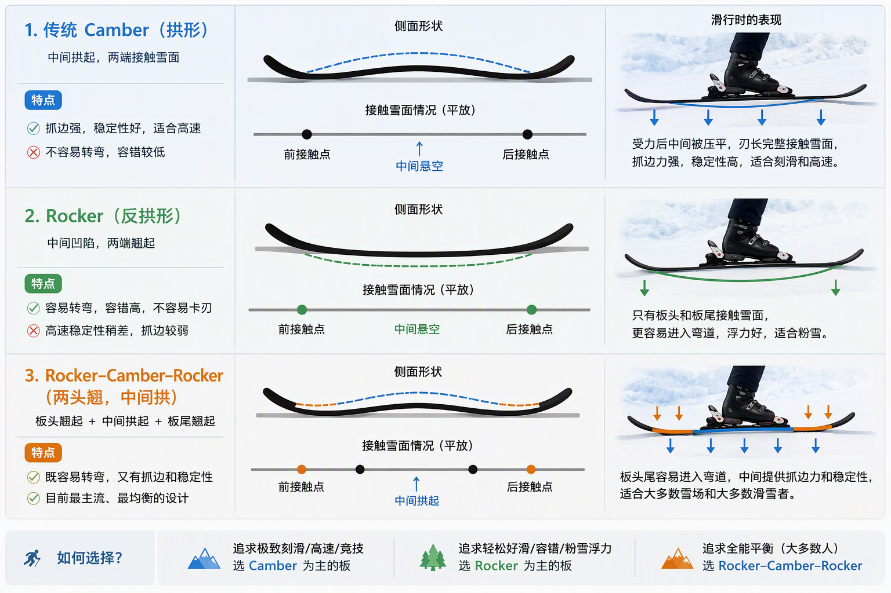

# 双板滑雪板
最重要的参数主要有几个
## 长度（Length）
单位：cm，一般来说，长板高速更稳，但转弯比较费劲；短板更灵活，转弯更轻松，但高速稳定性差。

常见范围：
- 初学者：身高减去 15~20cm
- 中级：身高减去 5~15cm
- 高级：接近身高甚至略高

### 有效刃长（Effective Edge）
有效刃长越长，边刃接触雪面越长，所以抓边更稳，冰面更稳。

同一块板长度增加后：

- 回转半径也会增加
- 稳定性增加
- 灵活性下降

## 腰宽（Waist Width）
指雪板最窄处的宽度。

不同腰宽特点
| 腰宽       | 类型                |
| -------- | ----------------- |
| 65-75mm  | 纯道内刻滑             |
| 75-85mm  | 全山板(All Mountain) |
| 85-100mm | 粉雪兼顾              |
| 100mm+   | 粉雪板               |

## 回转半径（Turn Radius）
例如 R = 13m，意思是：如果把雪板压到边刃极限，它自然画出的圆半径约13米。

数字越小，拐弯越急。一般非职业运动员，回转半径在14以下。

| Radius | 特点   |
| ------ | ---- |
| 10-13m | 小回转  |
| 13-16m | 中回转  |
| 16-20m | 大回转  |
| 20m+   | GS竞赛 |


## 硬度（Flex）
这一项厂家一般不会标数字，只能看定位。

### 软板

- 优点：
  - 容易压弯，对刚学平行弯的人非常友好
  - 容错高，实际上理想的进弯情况是重心居中，外脚受力，立刃角度合理，但是新手做不到也能转弯

- 缺点：
  - 高速发飘，比如滑到50km/h，高速时雪面会不断冲击雪板，软板因为容易变形而产生震动，让人感觉雪板在抖动，不稳定
 
### 硬板

- 优点：
  - 立刃强，刃切进雪面越深越能刻出轨迹，不会侧滑，在硬雪和冰面上更稳定。
  - 高速也很稳定，不变形，所以高手下黑道时经常喜欢硬一点的板。

- 缺点：
  - 需要技术

## Rocker & Camber
Rocker 和 Camber 可以理解成：把雪板平放在地面上时，它底部的弯曲形状。

这是影响雪板性格最重要的参数之一，甚至比硬度还明显。

  

### 传统 Camber
当站上雪板后，雪板被压平，边刃会均匀接触雪面。

优点：
- 抓边立刃强
- 刻滑稳定
- 高速稳

缺点：
- 不容易转
- 容错较低
- 新手容易卡刃

### Rocker
又叫Banana Shape（香蕉板），接触雪面后有效刃长度变短，板头更容易进入弯道。

优点：
- 入弯轻松
- 容错高
- 粉雪表现好，粉雪板经常是大Rocker，宽腰板

缺点：
- 高速稳定性差
- 抓边力弱

现在大多数雪板都是：Rocker + Camber + Rocker，也叫Tip & Tail Rocker

兼顾两者优点：

- 板头容易进弯
- 中间保持抓边
- 高速足够稳
- 不容易卡刃


## 板芯（Core）
- 木芯，Wood Core，推荐
- 木芯+金属，Titanal，高级板，对于初学者有点太硬。

## 固定器（Binding）
最重要参数：DIN值，比如
```
DIN 3-10
DIN 4-12
DIN 8-16
```
DIN简单来说就是**摔倒时多大力量会脱开**，越高越难脱落。

- DIN太低，刻滑时提前脱落，很危险
- DIN太高，摔了都不脱，容易受伤

固定器等级和品牌
- 入门，M10，EM10等，DIN 3-10
- 中级，M12，SPX12，Attack 13等，DIN 4-12
- 高级，SPX15，X16，Race16等，DIN 8-16，基本是民顶，竞速

比如Salomon Addikt Pro + MI12，这里的MI12就是固定器型号：
```
M = Model
12 = 最大DIN约12
```

## 雪板黑话
按照性能和价格，大致是：
```
休闲板
 ↓
进阶板
 ↓
次民顶
 ↓
民顶
 ↓
FIS
```

### FIS
FIS = 国际雪联认证竞赛板，最高等级。

例如：

- Atomic Redster S9 FIS
- Head WCR e-SL Rebel FIS
- Rossignol Hero FIS SL

它们用于正规比赛。

特点：

- 抓边极强
- 高速极稳
- 爆发力强

缺点：

- 非常难滑
- 腿累
- 低速不好玩

普通人不需要考虑。

### SL&GS
SL = Slalom（回转）
特点：
- 短半径
- 小回转
- 灵活
- 典型参数：长度165cm左右，半径12-13m

GS = 大回转
特点：
- 高速
- 大弧线
- 稳得像火车
- 典型参数：长度170-185cm左右，半径16-30m

### 民顶
民顶 = 民用顶级板

英文一般对应：Consumer Race，Race Carver，Top Model

就是普通人可以买到的最高级雪板，例如Salomon Addikt Pro

### 次民顶
次民顶 = 民顶下面一级

特点：
- 性能已经很强
- 更宽容
- 更容易滑
- 对技术要求没那么高

### デモ板
类似于中文的民顶，基于竞赛技术滑行开发的高级娱乐板。
