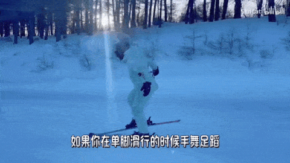
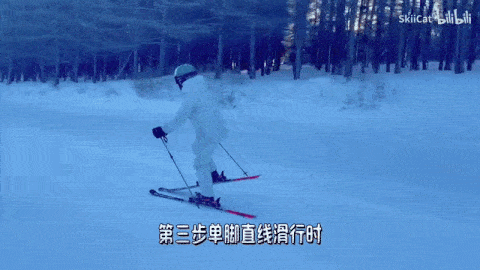
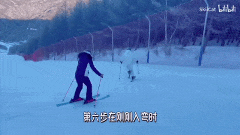
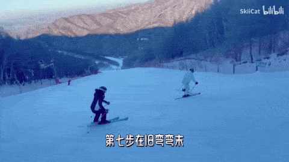
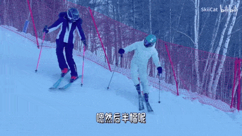
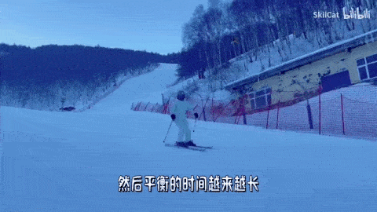
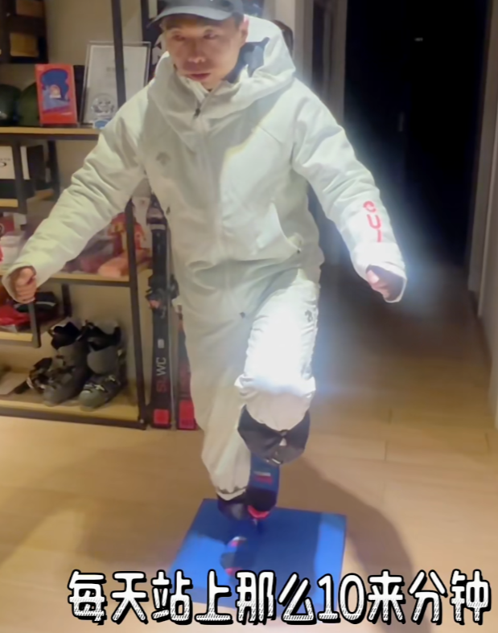
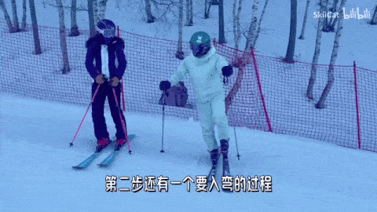

## 鹤弯
   

### 练习步骤
  
  
  
  
  
  

### 如何抬脚

注意反弓姿态  

### 半幅鹤弯
犁式入弯，到新弯的控制阶段再抬内脚。主要训练转弯阶段单脚承重以及转腿的感觉  

### 全幅鹤弯（更难）
旧弯弯末就抬内腿板  

#### 难点
##### 外刃平衡
  

加一个外刃平衡练习  
  

外刃平衡注意点  
  
滑的时候杖支点也可以撑着

可以在家里站在波速球或海绵软垫上练习平衡  

##### 翻滚脚踝

翻滚脚踝练习  

#### 全幅鹤弯的意义
比基础平行式更难，用于解决平行转弯时会出现小犁式的问题  

